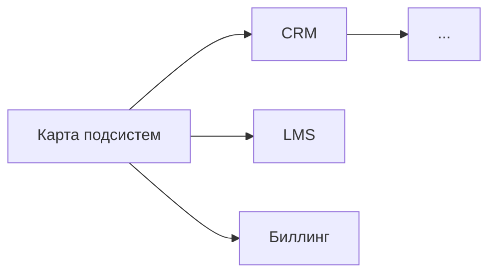
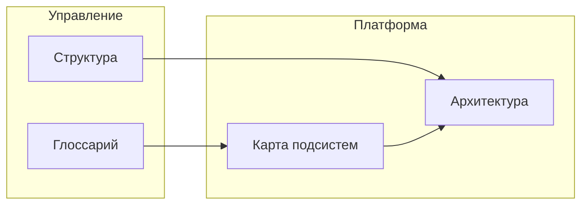

---

type: doc
status: active
created: 2025-12-09
layer: methodology
scope: global
---


# ТЗ Карта связей 0.4

## 0. Назначение документа

Техническое задание для ИИ по формированию отчёта «Карта связей между документами». Отчёт строит граф зависимостей между документами, выявляет изолированные узлы, хабы и кластеры.

---

## 1. Запуск генерации отчёта

### 1.1. Автоматический запуск

**Расписание:** Каждое воскресенье в 08:00 по московскому времени (05:00 UTC)

**Механизм:** GitHub Actions workflow

### 1.2. Ручной запуск

```bash
python3 .ops/build_report.py --report links-map
```

или через общий скрипт:

```bash
./.ops/build_all_reports.sh
```

---

## 2. Тепловая карта статуса

**ВАЖНО:** Тепловая карта должна показывать статус КАЖДОГО документа, а не только общую статистику. Связи должны быть проанализированы на релевантность и качество связанных документов.

В начале отчёта обязательно размещается тепловая карта:

| Индикатор | Значение | Описание |
|-----------|----------|----------|
| 🟢 | **Хорошо связан** | **ВСЕ критерии:** Документ имеет ≥5 связей (входящих + исходящих) И ≥70% связей указаны в текстовом контексте через wikilinks [[...]] (не только в frontmatter) И связи семантически релевантны (проверено содержание: связанные документы действительно относятся к теме) И связанные документы полные (каждый >500 слов с примерами и диаграммами, не заглушки) |
| 🟡 | **Слабо связан** | Документ имеет 3–4 связи И большинство связей релевантны (≥60%) И 40–69% связей текстовые (wikilinks в тексте) И связанные документы частично полные (≥50% связанных документов >300 слов) |
| 🔴 | **Изолирован** (по умолчанию) | **ЛЮБОЕ из условий:** Документ имеет ≤2 связей ИЛИ связи отсутствуют ИЛИ связи только формальные (в frontmatter, но не в тексте) ИЛИ связи нерелевантны (<40% связей по теме) ИЛИ связанные документы - это только заглушки (<50% связанных документов полные) |

**Формат тепловой карты в отчёте:**

**ОБЯЗАТЕЛЬНО:** Тепловая карта должна включать ВСЕ документы хранилища с анализом их связности!

```markdown
## Тепловая карта связей

**Сводка по статусам:**
- 🟢 Хорошо связаны: 45 документов (29%)
- 🟡 Слабо связаны: 67 документов (43%)
- 🔴 Изолированы: 45 документов (28%)

**Детализация по документам (первые 20, полный список см. ниже):**

| Документ | Всего связей | Текстовых | Входящих | Исходящих | % полных связанных | Статус |
|----------|--------------|-----------|----------|-----------|-------------------|--------|
| Глоссарий хранилища 0.1.md | 89 | 12 (13%) | 89 | 12 | 95% | 🟢 |
| Карта подсистем 3.2.md | 68 | 45 (66%) | 45 | 23 | 88% | 🟢 |
| Концепция созидателя 2.2.md | 34 | 28 (82%) | 22 | 12 | 91% | 🟢 |
| Классификация и теги 0.1.md | 4 | 2 (50%) | 2 | 2 | 75% | 🟡 |
| Модель семейств документов 0.1.md | 2 | 0 (0%) | 1 | 1 | 50% | 🔴 |
| Принципы организации хранилища 0.1.md | 1 | 0 (0%) | 0 | 1 | 0% | 🔴 |
| Словарь сущностей экосистемы 0.1.md | 5 | 5 (100%) | 3 | 2 | 100% | 🟢 |
| ... | ... | ... | ... | ... | ... | ... |

*Полная таблица со всеми 157 документами представлена в разделе 3.*
```

**Примечания к колонкам:**
- **Всего связей:** Сумма входящих и исходящих связей
- **Текстовых:** Количество и процент связей, указанных в тексте через wikilinks [[...]]
- **Входящих:** Сколько документов ссылаются на этот документ
- **Исходящих:** Сколько ссылок из этого документа на другие
- **% полных связанных:** Процент связанных документов, которые являются полными (>500 слов, не заглушки)

### 2.1. Показатель динамики улучшения

В отчёте обязательно включается раздел с анализом динамики по сравнению с предыдущими отчётами:

```markdown
## Динамика улучшения связности

| Категория | Предыдущий % | Текущий % | Изменение | Тренд |
|-----------|--------------|-----------|-----------|-------|
| Хорошо связаны (≥3) | 58% | 63% | +5% | ↑ Улучшение |
| Слабо связаны (1-2) | 32% | 27% | -5% | ↑ Улучшение |
| Изолированы (0) | 10% | 10% | 0% | → Стабильно |

**Сводка динамики:**
- **Уровень связности:** 63% (+5% к предыдущему периоду)
- **Количество изолированных документов:** Без изменений (10%)
- **Тренд:** ↑ Улучшение связности документов
- **Рекомендация:** Продолжить работу по устранению изолированных документов
```

## 3. Вход (исходные данные)

### 3.1. Источники данных

| Источник | Путь | Что извлекаем |
|----------|------|---------------|
| Все документы хранилища | `content/**/*.md` | Содержимое |
| Wikilinks | `[[...]]` в тексте | Исходящие связи |
| Markdown-ссылки | `[text](path)` | Исходящие связи |
| Frontmatter | YAML frontmatter | Декларированные связи: `depends_on`, `affects`, `related` |
| Паттерны связей | `Паттерны взаимосвязей документов 0.1.md` | Типы связей и их семантика |

### 3.2. Типы связей

Согласно [[Паттерны взаимосвязей документов 0.1]]:

| Тип | Формат | Семантика | Вес |
|-----|--------|-----------|-----|
| Wikilink | `[[Документ]]` | Ссылка в тексте | 1.0 |
| Wikilink с якорем | `[[Документ#раздел]]` | Точная ссылка на раздел | 1.0 |
| Markdown-ссылка | `[текст](путь.md)` | Ссылка в тексте | 0.8 |
| depends_on в frontmatter | `depends_on: [...]` | Сильная зависимость (родитель) | 1.5 |
| affects в frontmatter | `affects: [...]` | Сильное влияние (на детей) | 1.5 |
| related в frontmatter | `related: [...]` | Слабая связь | 1.2 |

---

## 4. Анализ (процесс обработки)

### 4.1. Алгоритм формирования

1. **Построение графа**
   - Для каждого документа: извлечь все исходящие ссылки
   - Построить направленный граф: узлы = документы, рёбра = ссылки
   - Рассчитать входящие связи для каждого узла

2. **Расчёт метрик**
   - **Degree** (степень): входящие + исходящие
   - **In-degree**: только входящие
   - **Out-degree**: только исходящие
   - **Betweenness centrality**: посредничество

3. **Выявление паттернов**
   - Изолированные узлы: degree = 0
   - Хабы: in-degree ≥ 10
   - Кластеры: группы связанных документов
   - Висячие узлы: только исходящие, без входящих

4. **Построение визуализации**
   - Mermaid-диаграмма для основных связей
   - Группировка по семействам

### 4.2. Правила анализа

- Битые ссылки (на несуществующие документы) — помечать отдельно
- Самоссылки — игнорировать
- Дублирующие ссылки — учитывать как одну

---

## 5. Выход (структура отчёта)

### 5.1. Заголовок и метаинформация

```markdown
# Карта связей между документами

> Автоматически сформирован: {дата и время}
> Узлов (документов): {N}
> Рёбер (связей): {M}
> Средняя связность: {X} связей на документ

---
```

### 5.2. Обязательные разделы отчёта

```markdown
## Тепловая карта связности

[Таблица со статусами — см. п. 2]

---

## 1. Executive Summary

- **Всего документов:** N
- **Всего связей:** M
- **Изолированных документов:** K (X%)
- **Документов-хабов (>10 связей):** L
- **Битых ссылок:** P
- **Связность графа:** Y% (связных компонент: Z)

---

## 2. Статистика связей

### 2.1. Распределение по количеству связей

| Связей | Документов | % | Визуализация |
|--------|------------|---|--------------|
| 0 | 15 | 10% | 🔴🔴🔴🔴🔴 |
| 1-2 | 40 | 27% | 🟡🟡🟡🟡🟡🟡🟡 |
| 3-5 | 50 | 33% | 🟢🟢🟢🟢🟢🟢🟢🟢 |
| 6-10 | 30 | 20% | 🟢🟢🟢🟢🟢 |
| >10 | 15 | 10% | 🟢🟢🟢 |

### 2.2. Связность по семействам

| Семейство | Документов | Связей | Среднее | Статус |
|-----------|------------|--------|---------|--------|
| F0 | 15 | 45 | 3.0 | 🟢 |
| F1 | 8 | 12 | 1.5 | 🟡 |
| ... | ... | ... | ... | ... |

---

## 3. Топ-10 документов по входящим связям (хабы)

| № | Документ | Входящих | Исходящих | Всего |
|---|----------|----------|-----------|-------|
| 1 | [[Глоссарий хранилища 0.1]] | 89 | 12 | 101 |
| 2 | [[Карта подсистем 3.2]] | 45 | 23 | 68 |
| ... | ... | ... | ... | ... |

---

## 4. Изолированные документы 🔴

Документы без входящих связей (на них никто не ссылается):

| № | Документ | Семейство | Исходящих | Создан | Рекомендация |
|---|----------|-----------|-----------|--------|--------------|
| 1 | `isolated_doc1.md` | F3 | 0 | 2025-01-01 | Связать с [[...]] |
| 2 | `isolated_doc2.md` | F7 | 2 | 2025-02-01 | Проверить актуальность |
| ... | ... | ... | ... | ... | ... |

---

## 5. Битые ссылки 🔴

Ссылки на несуществующие документы:

| № | Из документа | Ссылается на | Тип |
|---|--------------|--------------|-----|
| 1 | `doc1.md` | `[[Удалённый документ]]` | wikilink |
| 2 | `doc2.md` | `[текст](old_doc.md)` | markdown |
| ... | ... | ... | ... |

---

## 6. Кластеры документов

### 6.1. Кластер «Архитектура платформы» (23 документа)

**Главный хаб:** [[Карта подсистем 3.2]]



**Документы:** [[doc1]], [[doc2]], ...

### 6.2. Кластер «Созидатель» (18 документов)

**Главный хаб:** [[Модель созидателя 2.2]]

...

---

## 7. Граф связей (Mermaid)

> Показаны только документы с ≥3 связями



---

## 8. Рекомендации по связыванию

| Документ A | Рекомендуется связать с | Причина |
|------------|------------------------|---------|
| `doc1.md` | [[doc2]] | Общая тема, нет ссылки |
| `doc3.md` | [[doc4]] | Упоминает термин из doc4 |
| ... | ... | ... |

---

## 9. Связанные документы

- [[Концепция автоматических отчётов ИИ 0.4]]
- [[Рекомендации по развитию хранилища 0.4]]
```

---

## 6. Критерии качества

| Критерий | Требование |
|----------|------------|
| Полнота | Все документы учтены |
| Точность | Подсчёт связей верен |
| Визуализация | Mermaid-диаграмма присутствует |
| Actionability | Рекомендации по связыванию даны |
| Битые ссылки | Все обнаружены и перечислены |

---

## 7. Связанные документы

**Зависит от (depends_on):**
- [[Паттерны взаимосвязей документов 0.1]] — типы связей и их семантика
- [[Стандарты оформления документов 0.1]] — структура frontmatter
- [[Модель семейств документов 0.1]] — классификация по семействам

**Влияет на (affects):**
- [[Карта связей между документами 0.4]] — генерируемый отчёт

**Связанные (related):**
- [[Концепция автоматических отчётов ИИ 0.4]]
- [[ТЗ Рекомендации по развитию хранилища 0.4]]
