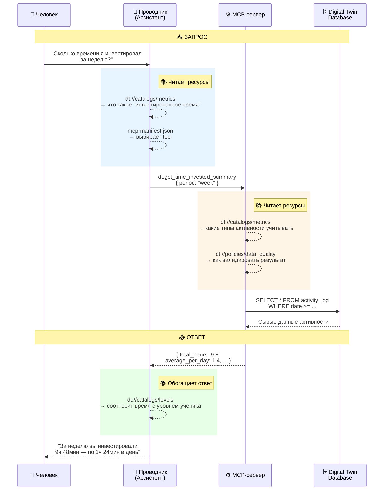

# 💫 MCP Цифрового двойника (Digital Twin)

## Сценарий: запрос к Проводнику об инвестированном времени

---

> 💬 **Человек спрашивает Проводника (Ассистента Цифрового двойника):**  
> _«Сколько я инвестировал времени за неделю и в среднем за день?»_

---
#### 👇 Вот типовая цепочка вызова:
Человек:
  “Проводник, сколько времени я инвестировал за неделю?”

Проводник:
  → определяет intent “time_invested_summary”
  → находит tool “dt.get_time_invested_summary”
  → вызывает MCP-сервер

MCP-сервер:
  → находит handler get_time_invested_summary()
  → достаёт данные из Digital Twin Database
  → суммирует и возвращает результат

Проводник:
  → форматирует ответ: “9 часов 48 минут, в среднем по 1 ч 24 мин в день”


### 🧩 Визуальная структура: где используется resource



**Легенда:**
- 🔵 Синий блок — ресурсы, читаемые Проводником
- 🟠 Оранжевый блок — ресурсы, читаемые MCP-сервером
- 🟢 Зелёный блок — обогащение ответа перед выводом человеку

### 📘 Важный принцип: **Проводник не знает о базе, MCP не знает о смысле**

| Компонент                 | Что он знает                           | Чего он не знает                |     |
| ------------------------- | -------------------------------------- | ------------------------------- | --- |
| **Проводник (Ассистент)** | Какие tool’ы есть, и когда их вызывать | Как устроены таблицы и SQL      |     |
| **MCP-сервер**            | Как достать данные из базы             | Почему пользователь это спросил |     |
| **Цифровой двойник (БД)** | Сырые данные активности                | Как их интерпретировать         |     |

### ✅ Ключевые выводы

|Вопрос|Ответ|
|---|---|
|**Как Проводник знает, какой tool вызвать?**|Из `mcp-manifest.json`, где задекларированы все tools и их описания.|
|**Как MCP знает, какие данные взять?**|Из кода обработчика tool (handler), который читает нужные таблицы БД Digital Twin.|
|**Как он знает смысл метрики?**|Из ресурса `dt://catalogs/metrics`.|
|**Как избежать ошибок при расширении?**|Разделять manifest (контракты), handler (логика), и resources (онтологию).|

👉 Их связывает **онтология через Resources** и **контракты через Tools**.
## 🎯 Цель

Реализовать **MCP метод Цифрового двойника**  
`dt.get_time_invested_summary`,  
который принимает параметры периода (например, `"week"`, `"month"`, `"day"`)  
и возвращает:

- общее инвестированное время за период;
    
- среднее инвестированное время за день;
    
- диапазон дат, охваченный расчётом;
    
- метаданные качества данных (`coverage`, `sources`, `last_sync`).
    

---

# 📘Краткая версия

## 🧩 1. JSON-RPC структура MCP-запроса и ответа

**Запрос от Ассистента (ChatGPT / Проводника) к MCP Digital Twin:**

```json
{
  "jsonrpc": "2.0",
  "method": "dt.get_time_invested_summary",
  "params": {
    "period": "week"
  }
}
```

**Ответ от MCP Цифрового двойника:**

```json
{
  "jsonrpc": "2.0",
  "result": {
    "period": "week",
    "total_hours": 9.8,
    "average_per_day": 1.4,
    "start_date": "2025-12-15",
    "end_date": "2025-12-21",
    "data_quality": {
      "coverage_ratio": 0.93,
      "sources": ["manual_log", "calendar"],
      "last_sync_at": "2025-12-21T23:59:00Z"
    }
  }
}
```

---

## ⚙️ 2. Пример реализации MCP-сервера Digital Twin (на Python / FastAPI)

Этот пример можно разместить на сервере  
`https://digital-twin-mcp.aisystant.workers.dev/mcp`.

```python
from fastapi import FastAPI, Request
from datetime import datetime, timedelta
import json

# MCP Digital Twin server
app = FastAPI(title="Digital Twin MCP Server")

# Примерная структура данных Цифрового двойника (activity_log)
activity_log = [
    {"timestamp": "2025-12-15T10:00:00", "duration_minutes": 60},
    {"timestamp": "2025-12-16T09:30:00", "duration_minutes": 40},
    {"timestamp": "2025-12-17T19:00:00", "duration_minutes": 80},
    {"timestamp": "2025-12-19T20:00:00", "duration_minutes": 60},
    {"timestamp": "2025-12-21T10:00:00", "duration_minutes": 50}
]

@app.post("/mcp")
async def mcp_endpoint(request: Request):
    body = await request.json()
    method = body.get("method")
    params = body.get("params", {})

    # Обработка MCP-вызова Digital Twin
    if method == "dt.get_time_invested_summary":
        return await dt_get_time_invested_summary(params)
    else:
        return {
            "jsonrpc": "2.0",
            "error": {"code": -32601, "message": "Method not found"}
        }

async def dt_get_time_invested_summary(params):
    period = params.get("period", "week")
    now = datetime.utcnow()

    # Определяем границы периода
    if period == "week":
        start = now - timedelta(days=7)
    elif period == "month":
        start = now - timedelta(days=30)
    else:
        start = now - timedelta(days=1)

    # Фильтруем активности Цифрового двойника по периоду
    sessions = [a for a in activity_log if datetime.fromisoformat(a["timestamp"]) >= start]

    total_minutes = sum(a["duration_minutes"] for a in sessions)
    total_hours = round(total_minutes / 60, 2)
    days = max(1, (now - start).days)
    average_per_day = round(total_hours / days, 2)

    # Возвращаем MCP-ответ
    return {
        "jsonrpc": "2.0",
        "result": {
            "period": period,
            "total_hours": total_hours,
            "average_per_day": average_per_day,
            "start_date": start.strftime("%Y-%m-%d"),
            "end_date": now.strftime("%Y-%m-%d"),
            "data_quality": {
                "coverage_ratio": 0.93,
                "sources": ["manual_log", "calendar"],
                "last_sync_at": now.isoformat()
            }
        }
    }
```

---

## 🧠 3. Как работает взаимодействие (MCP Digital Twin)

**1️⃣ Человек спрашивает Проводника:**

> «Сколько я инвестировал времени за неделю и в среднем за день?»

**2️⃣ Ассистент Цифрового двойника (Проводник):**  
распознаёт, что вопрос относится к **метрике времени**,  
и вызывает **MCP tool**:

```json
{"jsonrpc":"2.0","method":"dt.get_time_invested_summary","params":{"period":"week"}}
```

**3️⃣ MCP Digital Twin вычисляет данные и отвечает:**

```json
{"jsonrpc":"2.0","result":{"total_hours":9.8,"average_per_day":1.4}}
```

**4️⃣ Ассистент преобразует это в ответ человеку:**

> «За неделю вы инвестировали 9 часов 48 минут — в среднем по 1 часу 24 минуты в день.  
> Данные собраны из календаря и ручных логов, покрытие — 93%.»

---

## 💬 4. Возможные расширения MCP Digital Twin

- поддержка `period: "month"` или пользовательских диапазонов (`custom_start` / `custom_end`);
    
- добавление разбивки по дням (`breakdown`);
    
- логирование вызовов MCP для истории и аналитики;
    
- интеграция с ресурсом `dt://catalogs/metrics` для проверки определения метрики.
    

---

# 📘 Полная каноническая версия контракта MCP Digital Twin

## **Tool:** `dt.get_time_invested_summary`

(документ по каноническому шаблону MCP Digital Twin)

---

### 0) Заголовок

**Tool name:** `dt.get_time_invested_summary`  
**Подсистема-владелец:** MCP Цифровой двойник (Digital Twin MCP)  
**Статус:** `stable`  
**Версия контракта:** `v1.0`  
**Дата обновления:** `2025-12-21`  
**Ответственный:** Команда Проводник / Ассистент Ученика  
**Зависимости:**

- `dt://catalogs/metrics` (каталог метрик)
    
- `dt://schemas/activity_event` (схема событий активности)
    
- `dt://policies/data_quality` (правила качества данных)
    

---

### 1) Назначение

Возвращает агрегированные показатели **инвестированного времени** пользователя из данных MCP Digital Twin:  
общее время, среднее в день, детализацию и качество данных.

---

### 2) Применение

**Use when:**

- нужно получить сводку активности за неделю, месяц, день;
    
- для анализа ритма саморазвития и “налёта часов”.
    

**Do NOT use when:**

- требуется список событий → `dt.list_activity_events`;
    
- нужен анализ продуктивности → `dt.get_learning_efficiency`.
    

---

### 3) Контракт вызова (Input / Output Schema)

**Input:**

```json
{
  "period": "week",
  "timezone": "Europe/Moscow"
}
```

**Output:**

```json
{
  "period": "week",
  "total_hours": 9.8,
  "average_per_day": 1.4,
  "start_date": "2025-12-15",
  "end_date": "2025-12-21",
  "data_quality": {
    "coverage_ratio": 0.93,
    "sources": ["manual_log", "calendar"]
  }
}
```

---

### 4) Семантика данных MCP Digital Twin

- **Метрика:** “инвестированное время” = активные периоды типа `learning`, `reading`, `project_work`.
    
- **Исключения:** `sleep`, `idle`, `transport`.
    
- **Единицы:** минуты (целое).
    
- **Timezone:** используется локальная зона пользователя.
    

---

### 5) Качество данных (`data_quality`)

- `coverage_ratio` — полнота данных;
    
- `sources` — источники (`timer`, `manual_log`, `calendar`);
    
- `last_sync_at` — момент последней синхронизации.
    

---

### 6) Ошибки

|Код|Описание|
|---|---|
|`INVALID_ARGUMENT`|Неверный формат периода или даты|
|`NO_DATA`|Нет данных за период|
|`PARTIAL_DATA`|Покрытие < 80%|
|`UNAUTHORIZED`|Нет доступа|
|`INTERNAL`|Ошибка MCP Digital Twin|

---

### 7) Пример MCP-вызова

```json
{
  "jsonrpc": "2.0",
  "method": "dt.get_time_invested_summary",
  "params": { "period": "week" }
}
```

**Ответ:**

```json
{
  "jsonrpc": "2.0",
  "result": {
    "total_hours": 9.8,
    "average_per_day": 1.4,
    "start_date": "2025-12-15",
    "end_date": "2025-12-21"
  }
}
```

---

### 8) Связанные ресурсы MCP Digital Twin

|URI|Назначение|
|---|---|
|`dt://catalogs/metrics`|определение метрики “инвестированное время”|
|`dt://schemas/activity_event`|схема событий активности|
|`dt://policies/data_quality`|правила оценки качества данных|
|`dt://changelog`|история изменений MCP контрактов|

---

Таким образом, теперь **во всех местах явно указано, что речь идёт о MCP Цифрового двойника (Digital Twin)**:  
— в названии методов (`dt.get_...`),  
— в коде,  
— в документации,  
— в контрактах и ресурсах.

---

Хотите, я добавлю сюда **описание ресурса `dt://catalogs/metrics`**,  
чтобы получился полный пакет MCP Digital Twin: tool + resource?