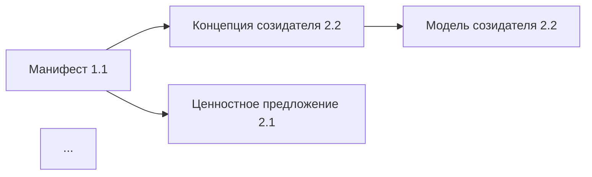

# Концепция автоматических отчётов ИИ

> Документ описывает структуру, назначение и способы применения автоматических отчётов, генерируемых ИИ по документам репозитория.

---

## 1. Суть работы: зачем нужны автоматические отчёты

### 1.1. Проблема, которую решаем

Хранилище экосистемы — это **живой организм**: ~150 документов, 1.4 МБ текста, распределённые по 9 семействам (F0–F9) и 4 уровням иерархии. При таком объёме возникают типичные проблемы:

| Проблема | Последствия |
|----------|-------------|
| **Рассогласованность** | Одни документы говорят одно, другие — другое |
| **Неполнота** | Пустые ячейки матрицы, отсутствующие связи |
| **Дрейф терминологии** | Один термин используется в разных значениях |
| **Устаревание** | Документы не обновляются после изменений в связанных |
| **Потеря контекста** | Сложно понять общую картину из отдельных файлов |

**Автоматические отчёты ИИ** — это механизм непрерывной диагностики здоровья хранилища, превращающий разрозненные документы в согласованную систему знаний.

### 1.2. Ценность для разных ролей

| Роль | Какую пользу получает |
|------|----------------------|
| **Архитектор платформы** | Видит целостность системы, находит архитектурные разрывы |
| **Методист/Создатель** | Понимает, как его документ встраивается в общую картину |
| **Новичок команды** | Быстро получает сводку «что есть и как связано» |
| **ИИ-агенты** | Используют отчёты как контекст для ответов и рекомендаций |
| **Руководитель** | Принимает решения на основе объективных метрик качества |
| **Аудитор/Внешний эксперт** | Оценивает зрелость документации экосистемы |

### 1.3. Принципы построения отчётов

1. **Автоматическая генерация** — минимум ручного труда, максимум воспроизводимости
2. **Трассируемость** — каждый вывод ссылается на конкретные документы-источники
3. **Actionable insights** — не просто факты, а рекомендации с приоритетами
4. **Инкрементальность** — возможность отслеживать изменения между версиями
5. **Многослойность** — от executive summary до детальных таблиц

---

## 2. Каталог отчётов

### 2.0. Обзор системы отчётов

```
┌─────────────────────────────────────────────────────────────────┐
│                    ПРОВЕРОЧНЫЙ ДОКУМЕНТ                         │
│            (главный агрегирующий отчёт, 107 КБ)                │
│                                                                 │
│  Собирает данные из:                                           │
│  ┌──────────────┐ ┌──────────────┐ ┌──────────────┐            │
│  │   Полнота    │ │ Противоречия │ │    Связи     │            │
│  │  хранилища   │ │     и        │ │   между      │            │
│  │              │ │несогласован. │ │ документами  │            │
│  └──────────────┘ └──────────────┘ └──────────────┘            │
│           │               │               │                     │
│           └───────────────┼───────────────┘                     │
│                           ▼                                     │
│               ┌──────────────────┐                              │
│               │  Рекомендации по │                              │
│               │    развитию      │                              │
│               └──────────────────┘                              │
└─────────────────────────────────────────────────────────────────┘
```

---

### 2.1. Проверочный документ (существует, 107 КБ)

**Файл:** `Проверочный документ 0.4.md`

**Назначение:** Верхнеуровневая сводка всей архитектуры экосистемы с проверкой согласованности между документами.

**Текущая структура:**
1. Зачем, для кого, что мы делаем
2. Персоны и роли
3. Рабочие продукты
4. Подсистемы платформы (список и контракты)
5. Мультиагентная ОС
6. Главные процессы (сквозные циклы)
7. Данные и МИМ (ядро сущностей/событий)
8. Эпистемический статус и доказательства
9. Экономика вклада
10. Культура и стандарты качества
11. Архитектурные границы (C4 + ADR)
12. Метрики
13. Приложения

**Периодичность:** Еженедельно (CI/CD: понедельник 09:00 UTC)

**Скрипт генерации:** `ops/build_check_document.py`

---

### 2.2. Полнота хранилища

**Файл:** `Полнота хранилища 0.4.md`

**Назначение:** Диагностика заполненности матрицы документов и выявление пробелов.

**Предлагаемая структура:**

```markdown
# Полнота хранилища

> Автоматически сформирован: {дата}

## Executive Summary
- Общая полнота: X% (заполнено Y из Z ячеек)
- Критические пробелы: N документов
- Прогресс за неделю: +M документов

## 1. Матрица полноты по семействам F0–F9

| Семейство | Ожидаемых | Есть | Полнота | Статус |
|-----------|-----------|------|---------|--------|
| F0 Управление | 15 | 14 | 93% | 🟢 |
| F1 Видение | 8 | 5 | 63% | 🟡 |
| F2 Контекст | 6 | 3 | 50% | 🟠 |
| ... | ... | ... | ... | ... |

## 2. Тепловая карта по матрице 3×3

```
             │ Смыслы │ Архитектура │ Операции │
─────────────┼────────┼─────────────┼──────────┤
Мир          │  🟢    │     🟡      │    🟢    │
Созидатель   │  🟡    │     🟢      │    🟠    │
Экосистема   │  🟠    │     🟢      │    🟡    │
```

## 3. Документы с пустым содержимым
| Файл | Создан | Последнее изменение | Приоритет |
|------|--------|---------------------|-----------|
| ... | ... | ... | ... |

## 4. Отсутствующие обязательные документы
- [ ] Описание подсистемы X (требуется для F8)
- [ ] ADR для решения Y (требуется для архитектуры)

## 5. Динамика заполнения (за последние 4 недели)
- График роста количества документов
- Скорость заполнения по семействам

## 6. Приоритизированный бэклог пробелов
1. 🔴 Высокий: [список с обоснованием]
2. 🟡 Средний: [список]
3. 🟢 Низкий: [список]
```

**Метрики:**
- Процент заполненности по семействам
- Количество пустых/stub документов
- Время с последнего обновления

---

### 2.3. Противоречия и несогласованности

**Файл:** `Противоречия и несогласованности 0.4.md`

**Назначение:** Выявление логических противоречий, терминологических расхождений и фактических несоответствий между документами.

**Предлагаемая структура:**

```markdown
# Противоречия и несогласованности

> Автоматически сформирован: {дата}
> Проанализировано документов: N
> Выявлено проблем: M (критических: K)

## Executive Summary
- Всего противоречий: X
- Критических (блокеров): Y
- Требуют внимания: Z
- Исправлено с прошлого отчёта: W

## 1. Критические противоречия 🔴

### 1.1. [ID-001] Конфликт определений «Созидатель»

**Источники:**
- `Концепция созидателя 2.2.md` (строка 45): "Созидатель — это..."
- `Манифест экосистемы 1.1.md` (строка 23): "Созидатель определяется как..."

**Суть противоречия:**
В первом документе созидатель описан как роль, во втором — как состояние.

**Влияние:** Высокое — затрагивает понимание целевой аудитории

**Рекомендация:** Согласовать определение, обновить Глоссарий

---

## 2. Терминологические расхождения 🟡

| Термин | Вариант 1 | Где | Вариант 2 | Где |
|--------|-----------|-----|-----------|-----|
| Экзокортекс | "внешняя память" | doc1.md | "ИИ-помощник" | doc2.md |
| ... | ... | ... | ... | ... |

## 3. Фактические несоответствия 🟠

### 3.1. Несовпадение списков подсистем
- В `Карта подсистем 3.2.md`: 17 подсистем
- В `Проверочный документ 0.4.md`: 15 подсистем
- Отсутствуют: X, Y

## 4. Устаревшие ссылки
| Документ | Ссылается на | Проблема |
|----------|--------------|----------|
| doc1.md | old_doc.md | Файл удалён |
| ... | ... | ... |

## 5. Дублирование контента
| Контент | Встречается в | Рекомендация |
|---------|---------------|--------------|
| Описание процесса X | doc1, doc2, doc3 | Выделить в отдельный документ |

## 6. История противоречий
- График динамики количества противоречий
- Среднее время устранения
```

**Типы проверок:**
1. **Семантический анализ** — сравнение определений терминов
2. **Структурный анализ** — соответствие списков и перечислений
3. **Ссылочная целостность** — проверка wikilinks
4. **Временная согласованность** — даты, версии, статусы

---

### 2.4. Карта связей между документами

**Файл:** `Карта связей между документами 0.4.md`

**Назначение:** Визуализация и анализ графа зависимостей документов для выявления изолированных узлов, циклов и критических путей.

**Предлагаемая структура:**

```markdown
# Карта связей между документами

> Автоматически сформирован: {дата}
> Узлов (документов): N
> Рёбер (связей): M
> Связность графа: X%

## Executive Summary
- Изолированные документы: Y
- Документы-хабы (>10 связей): Z
- Критический путь: A → B → C

## 1. Статистика связей

### 1.1. Распределение по количеству связей
| Связей | Документов | % |
|--------|------------|---|
| 0 | 5 | 3% |
| 1-3 | 45 | 30% |
| 4-10 | 80 | 53% |
| >10 | 20 | 14% |

### 1.2. Топ-10 документов по входящим связям
| Документ | Входящих | Исходящих |
|----------|----------|-----------|
| Глоссарий хранилища 0.1.md | 89 | 12 |
| Карта подсистем 3.2.md | 45 | 23 |
| ... | ... | ... |

## 2. Граф связей (Mermaid)



## 3. Изолированные документы 🔴
Документы без входящих/исходящих связей:
- `isolated_doc1.md` — создан {дата}, требует интеграции
- ...

## 4. Кластеры документов
| Кластер | Документов | Тема | Главный узел |
|---------|------------|------|--------------|
| Архитектура платформы | 23 | F8 | Карта подсистем |
| Созидатель | 18 | F4-F6 | Модель созидателя |
| ... | ... | ... | ... |

## 5. Критические зависимости
Документы, от которых зависит много других:
1. `Глоссарий` — 89 зависимых (если изменится — каскад)
2. ...

## 6. Рекомендации по связыванию
| Документ A | Рекомендуется связать с | Причина |
|------------|------------------------|---------|
| doc1.md | doc2.md | Общая тема, нет ссылки |
```

**Визуализации:**
- Mermaid-диаграммы для Obsidian
- Интерактивный граф (экспорт в HTML)
- Матрица смежности по семействам

---

### 2.5. Рекомендации по развитию

**Файл:** `Рекомендации по развитию 0.4.md`

**Назначение:** Приоритизированный список действий по улучшению хранилища на основе анализа всех предыдущих отчётов.

**Предлагаемая структура:**

```markdown
# Рекомендации по развитию

> Автоматически сформирован: {дата}
> На основе отчётов: Полнота, Противоречия, Карта связей
> Всего рекомендаций: N (выполнено с прошлого раза: M)

## Executive Summary

**Здоровье хранилища:** 🟡 Удовлетворительное (72/100)

| Измерение | Оценка | Тренд |
|-----------|--------|-------|
| Полнота | 78% | ↑ +3% |
| Согласованность | 65% | ↓ -2% |
| Связность | 82% | → 0% |
| Актуальность | 71% | ↑ +5% |

## 1. Критические действия (эта неделя) 🔴

### 1.1. Устранить противоречие в определении «Созидатель»
- **Источник:** Отчёт «Противоречия», ID-001
- **Ответственный:** @архитектор
- **Трудоёмкость:** 2 часа
- **Действия:**
  1. Согласовать определение с командой
  2. Обновить `Глоссарий хранилища 0.1.md`
  3. Проверить все документы с упоминанием термина

### 1.2. Заполнить пустой документ «Стратегия партнёрств»
- **Источник:** Отчёт «Полнота», F3
- **Важность:** Блокирует описание внешних интеграций
- ...

## 2. Важные улучшения (этот месяц) 🟡

### 2.1. Добавить недостающие ADR
- ADR-007: Выбор системы идентификации
- ADR-008: Архитектура биллинга
- ...

### 2.2. Улучшить связность раздела «Мир»
- Связать документы 1.1 ↔ 1.2 ↔ 1.3
- Добавить cross-references в регуляторику

## 3. Желательные улучшения (бэклог) 🟢

| № | Рекомендация | Источник | Приоритет |
|---|--------------|----------|-----------|
| 1 | Унифицировать формат frontmatter | Полнота | Низкий |
| 2 | Добавить диаграммы в архитектуру | Связи | Низкий |
| ... | ... | ... | ... |

## 4. Метрики прогресса

### 4.1. Выполнение рекомендаций за последние 4 недели
| Неделя | Критических | Важных | Желательных |
|--------|-------------|--------|-------------|
| W-4 | 2/3 | 5/8 | 3/12 |
| W-3 | 3/3 | 4/6 | 2/10 |
| ... | ... | ... | ... |

### 4.2. Тренды здоровья хранилища
- График оценки здоровья за 3 месяца

## 5. Автоматически сгенерированные задачи

Следующие задачи рекомендуется создать в системе управления:

```yaml
- title: "Устранить противоречие ID-001"
  labels: [documentation, high-priority]
  assignee: architect

- title: "Заполнить Стратегия партнёрств 1.3"
  labels: [documentation, content]
  milestone: Q1-2025
```
```

---

## 3. Дополнительные отчёты (предложения на будущее)

### 3.1. Отчёт «Глоссарий: использование терминов»

**Назначение:** Анализ использования терминов из глоссария в документах.

**Содержание:**
- Термины из глоссария, которые не используются
- Слова, похожие на термины, но не в глоссарии
- Частотность использования терминов
- Контексты употребления (для обнаружения дрейфа значений)

### 3.2. Отчёт «Архитектурные решения (ADR)»

**Назначение:** Сводка по всем ADR с анализом их актуальности.

**Содержание:**
- Список всех ADR со статусами
- ADR, требующие пересмотра (возраст > 6 месяцев)
- Решения без ADR (архитектурный долг)
- Связь ADR с подсистемами

### 3.3. Отчёт «Активность и устаревание»

**Назначение:** Анализ динамики изменений и выявление устаревающих документов.

**Содержание:**
- Документы без изменений > 3 месяцев
- Топ-активных документов (частые правки)
- Корреляция активности с важностью
- Прогноз устаревания

### 3.4. Отчёт «Качество документов»

**Назначение:** Оценка качества оформления и содержания документов.

**Содержание:**
- Документы без frontmatter
- Документы без структурированных разделов
- Оценка читаемости (длина предложений, сложность)
- Наличие примеров, диаграмм, таблиц

### 3.5. Отчёт «Онбординг: путь новичка»

**Назначение:** Анализ документов с точки зрения нового участника.

**Содержание:**
- Рекомендуемая последовательность чтения
- Документы с избыточными предпосылками
- Отсутствующие «мостики» между разделами
- Оценка времени на изучение разделов

---

## 4. Как применять отчёты

### 4.1. Регулярный цикл (рекомендуется)

```
┌─────────────────────────────────────────────────────────────┐
│                    ЕЖЕНЕДЕЛЬНЫЙ ЦИКЛ                        │
├─────────────────────────────────────────────────────────────┤
│                                                             │
│  Понедельник (автоматически):                               │
│  ┌─────────────────────────────────────┐                    │
│  │ CI/CD генерирует все отчёты         │                    │
│  │ → commit в ветку main               │                    │
│  └─────────────────────────────────────┘                    │
│                     ↓                                       │
│  Вторник (команда):                                         │
│  ┌─────────────────────────────────────┐                    │
│  │ Архитектор просматривает            │                    │
│  │ «Рекомендации по развитию»          │                    │
│  │ → создаёт задачи на неделю          │                    │
│  └─────────────────────────────────────┘                    │
│                     ↓                                       │
│  В течение недели:                                          │
│  ┌─────────────────────────────────────┐                    │
│  │ Команда выполняет задачи            │                    │
│  │ → исправления попадают в PR         │                    │
│  │ → merge → обновление документов     │                    │
│  └─────────────────────────────────────┘                    │
│                     ↓                                       │
│  Пятница (опционально):                                     │
│  ┌─────────────────────────────────────┐                    │
│  │ Ретро: что улучшили за неделю       │                    │
│  │ → метрики прогресса                 │                    │
│  └─────────────────────────────────────┘                    │
│                                                             │
└─────────────────────────────────────────────────────────────┘
```

### 4.2. Использование по ролям

| Роль | Отчёт | Как использует | Частота |
|------|-------|----------------|---------|
| **Архитектор** | Все | Планирование работ, контроль качества | Еженедельно |
| **Методист** | Противоречия, Связи | Проверка своих документов | При создании/правке |
| **Новичок** | Проверочный документ | Первичное знакомство с системой | Однократно |
| **ИИ-агент** | Проверочный документ | Контекст для ответов | При каждом запросе |
| **Руководитель** | Рекомендации | Принятие решений о приоритетах | Ежемесячно |

### 4.3. Интеграция с рабочими процессами

**В Obsidian:**
- Dataview-запросы для динамических таблиц
- Горячие клавиши для запуска генерации (Shell Commands plugin)
- Граф связей через встроенный Graph View

**В GitHub:**
- CI/CD workflow генерирует отчёты по расписанию
- PR-чеки показывают изменение метрик
- Issues создаются автоматически для критических проблем

**В командной работе:**
- Отчёты как agenda для еженедельных созвонов
- Метрики в дашборде команды
- Уведомления о критических противоречиях в чат

---

## 5. Технические требования

### 5.1. Скрипты генерации

| Отчёт | Скрипт | Зависимости |
|-------|--------|-------------|
| Проверочный документ | `build_check_document.py` | Существует ✅ |
| Полнота хранилища | `build_completeness_report.py` | Требуется создать |
| Противоречия | `build_contradictions_report.py` | Требуется создать |
| Карта связей | `build_links_map.py` | Требуется создать |
| Рекомендации | `build_recommendations.py` | Требуется создать |

### 5.2. AI-анализ

Для глубокого анализа (противоречия, рекомендации) используется:
- OpenAI API (GPT-4) — текущая реализация в `build_check_document.py`
- Возможность локальных моделей для приватности

### 5.3. Форматы вывода

- **Markdown** — основной формат для Obsidian
- **JSON** — для программной обработки
- **HTML** — для интерактивных визуализаций

---

## 6. Метрики успеха

Критерии эффективности системы отчётов:

| Метрика | Целевое значение | Как измеряем |
|---------|------------------|--------------|
| Полнота хранилища | >85% | Отчёт «Полнота» |
| Противоречий | <10 критических | Отчёт «Противоречия» |
| Изолированных документов | <5% | Отчёт «Карта связей» |
| Время устранения критического противоречия | <7 дней | История отчётов |
| Регулярность обновлений | Еженедельно | CI/CD логи |

---

## 7. План реализации

| Этап | Отчёт | Сложность | Приоритет |
|------|-------|-----------|-----------|
| 1 | Полнота хранилища | Низкая | 🔴 Высокий |
| 2 | Карта связей | Средняя | 🔴 Высокий |
| 3 | Противоречия (базовый) | Средняя | 🟡 Средний |
| 4 | Рекомендации | Низкая | 🟡 Средний |
| 5 | Противоречия (AI-анализ) | Высокая | 🟢 Низкий |
| 6 | Дополнительные отчёты | Варьируется | 🟢 Низкий |

---

## Связанные документы

- [[Проверочный документ 0.4]]
- [[Структура проверочного документа 0.3.1]]
- [[Модель семейств документов 0.1]]
- [[Стандарты оформления документов 0.1]]
